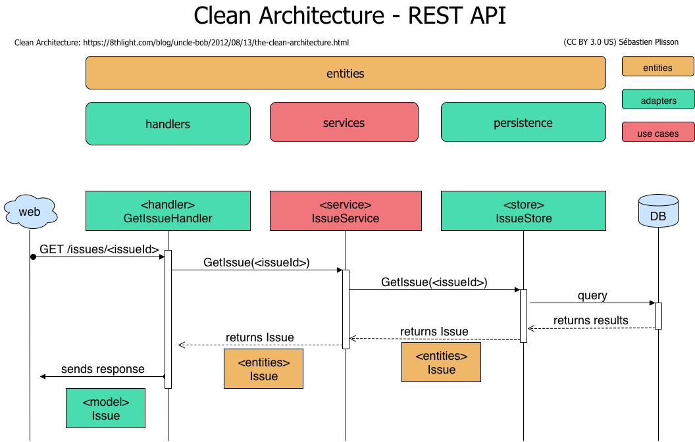
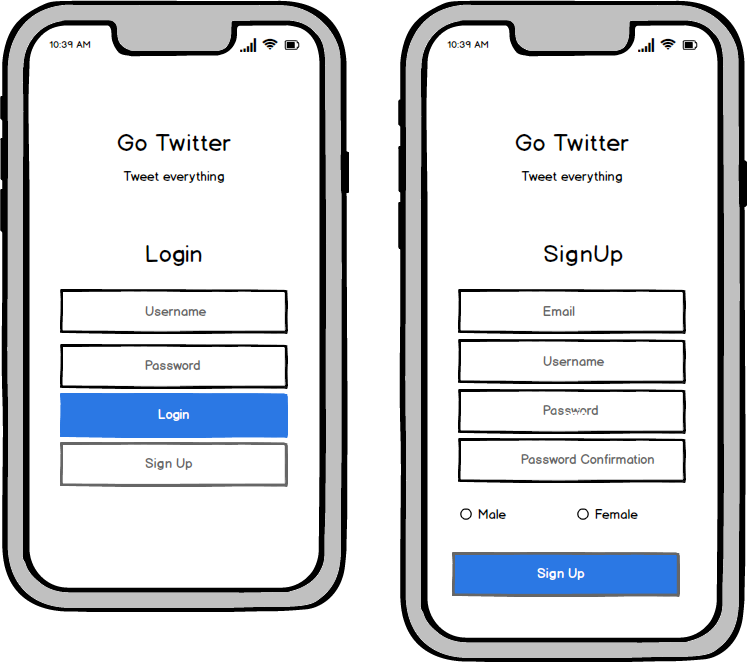
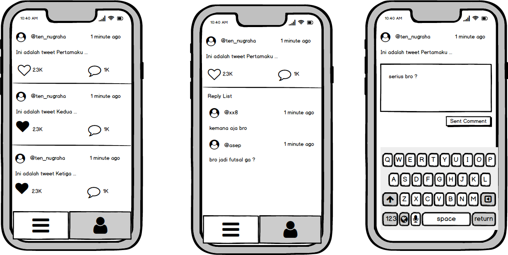
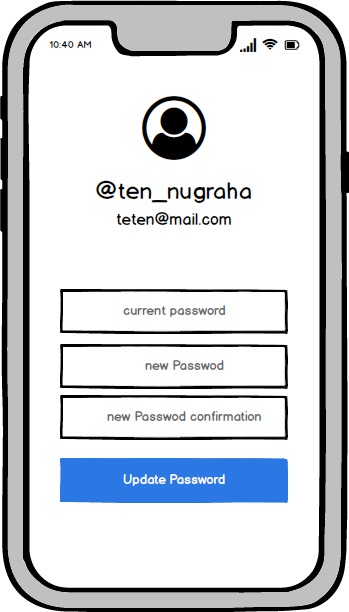

## Table of contents

* [General info](#general-info)
* [Technologies](#technologies)
* [Setup](#setup)

## General info

Twitter Clone Rest API dalam repo ini adalah mencoba membuat beberapa functionalitas yang ada di media sosial twitter, namun dalam repo ini ada pembatasan yaitu hanya fungsi auth, timeline dan profile saja seperti yang ada dalam screenshoot dibawah. Rencananya untuk impelemtasi mobile akan menggunakan react native.

Repository adalah hasil percobaan penulis dalam belajar Golang yang mana menggunakan Clean Architecture, yang memisahkan setiap layer aplikasi. Pada umumnya dibedakan menjadi layer :

1. Repository
2. Service
3. Handler





## Technologies

Project ini menggunakan beberapa teknologi yaitu :

* Golang Versi 1.15
* Echo Labstack 
* GORM
* Godotenv
* Logrush
* MySQL

## Setup

Sebelum itu pastikan MySQL sudah running dan buat sebuah database dengan nama **golang_crud** dan sesuaikan dengan yang ada di **file .env**

Berikut langkah-langkah untuk running repo ini

```
$ git clone https://github.com/teten-nugraha/golang-twitter-clone-api.git
$ go mod download
$ go run main.go
```


### Screenshoot







